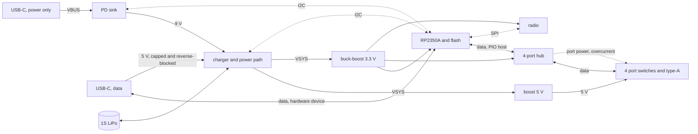

# crossfire hardware

The production board: an RP2350 hosting four USB instruments through a hub, powered from USB-C over
Power Delivery, with an optional radio and an optional battery.

**Status: prototype, nothing built.** Every number below is a budget or a datasheet figure, not a
measurement. A predecessor design exists elsewhere as a sketch of an earlier vision; it was never
manufactured or validated, so nothing here is inherited from it — individual parts are reused only
where they stand up on their own.

## What the board has to do

- Host four USB-MIDI instruments at once, on four type-A receptacles, each supplied with 5 V.
- Keep the firmware that already exists: the USB device role and its console, the signed
  A/B image pair with probation, and the radio update path.
- Present itself to a computer on the upstream connector *while* hosting the instruments, so the two
  roles live on separate interfaces.
- Take its power from an upstream USB-C connector, separate from the one a computer plugs into.
- Optionally carry a radio for over-the-air updates and for a client app to control it.
- Optionally run from a LiPo cell for at least an hour under load.

## Three decisions shape everything else

### 1. Two USB roles on two interfaces

The RP2350 has **one** USB controller, and the board needs two roles at once: host for the four
instruments, device for the computer on the upstream connector. The roles are kept apart on separate
interfaces — the hardware controller takes one, and a full-speed port built in PIO takes the other.
Nothing is multiplexed and nothing switches role, so a computer and the instruments are live at the
same time.

**The hardware controller faces outward as the device, and PIO hosts the hub.** The deciding
argument is recovery, and it beats the alternative on its own terms:

- **The boot ROM drives the hardware controller.** Putting that pair on the upstream connector means
  BOOTSEL and USB DFU work on the connector the product actually has. Recovery needs no debug probe,
  no case opened, nobody on the bench.
- **It makes the risky new thing the recoverable one.** The host side is what has to be rebuilt, and
  if that goes wrong the board can still be reflashed over its own port. The other way round, a rough
  device port takes the console and DFU with it and leaves only SWD.
- **Bring-up starts working rather than blocked.** The board is programmable and has a console over
  its own connector before any of the new firmware exists, so the host side can be brought up
  incrementally against a board that already talks.

What it costs, plainly: **the host role moves onto a new transport.** The existing host stack sits
behind a host-controller seam, so the stack, the hub handling and the MIDI layer above it are kept —
but the packet-level transport underneath becomes a full-speed USB host built in PIO, which does not
exist in this tree. That is the single largest piece of new firmware this board asks for, and it is
the harder of the two roles to build: it has to generate frames, schedule transactions across four
devices and a hub, and handle retries.

The device side, by contrast, is already proven on hardware — the console rides it today. The one
addition there is the computer-facing MIDI interface, which is a device class on a working stack.

**The upstream connector is unambiguous.** It sinks power and acts as a device, both, always — so
the CC lines mean one thing, there is no role to choose, and the charger-versus-computer guess that a
multiplexed design would have needed is gone. Electrically it is also the simpler end: the hardware
controller's pins carry their own impedance matching and pull-ups, so the pair needs only an ESD
array and the receptacle's two data pairs tied together, so a cable can go in either way up.

**The PIO port sets the system clock, and it sets it upward: 240 MHz.** Full-speed bit timing off PIO
wants a system clock that is an integer multiple of 12 MHz, so the state-machine divider is exact and
the bit period carries no fractional jitter. The stock 150 MHz is not such a multiple. Going *down* to
120 MHz would satisfy it at the cost of a fifth of the loop; going up to 240 MHz satisfies it and buys
the loop instead, and four things line up on that number:

- **12 MHz × 20.** Twenty system cycles per bit, and an exact divide by two if the state machine wants
  to run at 120 MHz. Either way the divider is an integer.
- **Twenty cycles a bit is a generous instruction budget** for the hardest software on the board. Ten
  would have been tight. The clock that makes the timing legal also makes the program easier to write.
- **It is already proven on this silicon.** A board in this codebase runs RP2350 at 240 MHz today,
  from the crystal through a 1440 MHz VCO and a divide by six, at stock core voltage.
- **The flash stays at its fastest legal clock.** A 133 MHz part divided by two off 240 MHz is
  120 MHz. Higher multiples are worse here, not better: 288 MHz would need a divide by three and drop
  the flash to 96 MHz.

So the constraint that looked like a tax is a 1.6× clock increase, and the forwarding loop gets
faster rather than slower. The device port is unaffected either way — its 48 MHz comes from the other
PLL.

**It is an overclock, though, and that is the part to weigh.** 240 MHz is above the datasheet's
150 MHz. It is proven on the boards in hand; it is not characterised across a production population
or a temperature range, and a product ships into both. What to establish before committing: whether
stock core voltage still holds at temperature, and what the fallback is if it does not — 192 MHz
(12 × 16) is the next multiple down that still beats stock, and 120 MHz is the floor that always
works.

The PIO port is the host end, so it carries 27 Ω series resistors on the pair and host-side
pull-downs; the 1.5 kΩ pull-up belongs to the hub, which asserts it on its own upstream port. It runs
entirely on the board, from GPIOs to the hub, and never reaches a connector or a cable — which is the
kindest possible first home for a software-timed USB port.

One consequence of hosting on-board: **no host supplies VBUS to the hub's upstream port**, so the hub
is strapped self-powered and its upstream-detect input is driven from the board's own 5 V through a
divider. Without that the hub never believes it is connected.

### 2. Two upstream connectors, one for power and one for data

Power and data arrive on **separate USB-C receptacles**. One connector would force a choice: a port
negotiating 9 V off a charger is not a port a computer is plugged into, so whichever you wanted, you
gave up the other. Two connectors means a 27 W brick and a computer at once, and neither constrains
the other.

| | receptacle | carries |
| --- | --- | --- |
| power | type-C, power only, 6-pin | CC to the PD sink, VBUS to the charger — the designed power input |
| data | type-C, USB 2.0, 16-pin | D+/D− to the hardware controller, Rd on both CC pins, ESD, VBUS sensed |

Splitting them also cleans up what each one means. The power port negotiates without caring what a
computer would think of the result. The data port is only ever a data link — BOOTSEL, DFU, the
console and the MIDI interface all live on a connector that does nothing else.

**The data port still contributes a little power**, and it has to. Without it, a board with no
battery and no charger cannot be reflashed from a laptop, which is exactly the situation a
manufacturing line and a returned unit are in. Its contribution is capped at the USB default: about
2.5 W, which runs the MCU, hub and radio and trickles the cell, and does not pretend to run the
ports. That is not a limitation worth fighting — a laptop was never going to supply the 10 W four
ports can ask for.

> **The reverse blocking has to be automatic, not timed by firmware.** The moment the power port
> negotiates 9 V, that voltage must not appear on a laptop's VBUS, and there is no software fast
> enough to be trusted with it. So the data port's contribution goes through a reverse-blocking
> element that the higher voltage shuts off by itself.

**Neither way of plugging it in wrongly does harm**, which matters because two identical receptacles
on one edge guarantee someone will. A charger in the data port presents as an ordinary 5 V source and
is used as one. A computer in the power port supplies 5 V and simply has no data pins to reach. Both
cases degrade; neither damages.

Optionally the data port's two CC voltages go to a pair of ADC inputs, so the firmware reads what the
attached source actually advertises instead of assuming the default. Two resistors and two pins turn
a guess into a measurement.

### 3. What "under load" means

Four ports at full USB 2.0 spec is 4 × 500 mA = 10 W, and an hour of that needs a cell around
4500 mAh. Class-compliant MIDI instruments draw 100–250 mA. Sizing the battery for a load no MIDI
instrument presents buys a much larger cell for nothing.

**Taken as:** the ports run to **full spec on external power**, and to a declared **250 mA each on
battery**. The power manager already exists and is portable, so the budget is policy rather than
silicon — the current limits in the port switches protect the hardware, and the policy decides what
is offered. This is the one assumption here that most wants confirming.

## Block structure



*Solid lines carry power or USB data; dashed lines are control.*

## Power

### Rails

| rail | source | sized for | why |
| --- | --- | --- | --- |
| VSYS | the charger's system node, 3.0–4.4 V | 4 A | the battery when unplugged, held up by the charger when not |
| 5 V (ports) | boost from VSYS | 2 A | **always the same converter**, so a port sees the same 5 V plugged in or not |
| 3.3 V | buck-boost from VSYS | 1 A | VSYS falls below 3.3 V on a flat cell, so a plain buck could not hold it |

Port power comes from VSYS rather than straight off VBUS. It costs a conversion when plugged in
(about 90%), and it buys two things: a 5 V rail that does not change character when the cable is
pulled, and the freedom to negotiate 9 V upstream instead of being held to the 15 W that 5 V/3 A
allows. The alternative — ports fed from VBUS, with the charger's OTG boost back-driving VBUS on
battery — saves the boost entirely, and is the obvious cost-down if 15 W upstream turns out to be
enough.

### Budget

**3.3 V rail**

| | typical | peak |
| --- | --- | --- |
| RP2350A, both cores at 240 MHz, USB active | 110 mA | 150 mA |
| QSPI flash, executing in place | 15 mA | 25 mA |
| hub | 90 mA | 120 mA |
| radio, connected idle / transmitting | 60 mA | 350 mA |
| indicators, crystals, pull-ups | 25 mA | 40 mA |
| **total** | **300 mA** (0.99 W) | **685 mA** (2.3 W) |

**5 V rail**

| | current | power |
| --- | --- | --- |
| full USB 2.0 spec, 4 × 500 mA | 2.00 A | 10.0 W |
| declared battery budget, 4 × 250 mA | 1.00 A | 5.0 W |
| four typical MIDI instruments | 0.4–0.8 A | 2–4 W |

**Upstream**

Worst case on external power is 10.0 W of ports and 2.3 W of device, which is 13.6 W at VSYS after
conversion and about 14.8 W at the PD rail. Charging a 3000 mAh cell at 1.5 A adds 6 W.

> 5 V/3 A is 15 W and cannot do both. **Request 9 V at 3 A (27 W)**; accept 9 V/2 A with the charge
> current trimmed; fall back to 5 V/3 A with the ports held to the battery budget.

**Battery**

At the declared budget the board draws 6.7 W at VSYS. An hour of that is 6.7 Wh; a 1S cell at 3.7 V
nominal carries 1800 mAh of it, and roughly 90% is usable down to cutoff before any allowance for
age.

> **Specify a 3000 mAh 1S LiPo (11.1 Wh), rated 2 C continuous or better.** That is about 77 minutes
> at the declared budget and about 42 minutes with every port drawing its full 500 mA. Peak
> discharge at full spec is around 3.5 A, which is why the C rating is called out.

## Parts

Stock KiCad symbols exist for everything marked with one; the rest need drawing.

| block | part | symbol | why |
| --- | --- | --- | --- |
| MCU | RP2350A, QFN-60 | `MCU_RaspberryPi:RP2350A` | 30 GPIO is enough (see below); RP2350B if a display is added |
| flash | W25Q128JVS, 16 MB | `Memory_Flash:W25Q128JVS` | the A/B image pair plus the asset partition; 2 MB would not hold it, and its 133 MHz rating covers the 120 MHz the divider lands on |
| hub | USB2514B | `Interface_USB:USB2514B_Bi` | four downstream ports, per-port power and overcurrent pins, no external EEPROM needed |
| port switch ×4 | TPD3S014 | `Power_Protection:TPD3S014` | one part per port covering the current-limited VBUS switch *and* the D+/D− ESD |
| PD sink | HUSB238 | `Interface_USB:HUSB238_xxxDD` | already proven on hardware in this codebase, and it reports which profile was accepted |
| charger / PMIC | BQ25798 | `Battery_Management:BQ25798` | buck-boost, takes 9 V in directly, 1S charge, and an I²C ADC the power manager can read |
| 5 V boost | TPS61089 | — | 5 A switch, comfortably 2 A out at 5 V from a 1S cell |
| 3.3 V | TPS63060 | — | buck-boost, so 3.3 V survives a flat cell |
| upstream data ESD | 2-channel array, low capacitance | — | the downstream pairs get theirs from the port switch; the upstream pair has no such part in front of it |
| power connector | USB-C, power only, 6-pin | `Connector:USB_C_Receptacle_PowerOnly_6P` | no data pins to mis-wire, and nothing on it a computer would want |
| data connector | USB-C 2.0, 16-pin | `Connector:USB_C_Receptacle_USB2.0_16P` | |
| source ORing | prioritised ORing controller with external FETs | — | the two inputs meet at the charger, and 9 V must never reach a laptop; a part rated well above 9 V, not a 5.5 V mux |
| port connectors ×4 | type-A | `Connector:USB_A` | |
| radio | CYW43439 module, pre-certified | — | the firmware is proven against this silicon; a module rather than the bare chip, so the radio arrives certified |

Two notes on the hub. Its upstream link runs at full speed, because the RP2350's controller is
full-speed only — so the whole tree is full speed and instruments that could do high speed fall
back, which costs nothing, as USB-MIDI 1.0 is a full-speed class. And the hub drives the port
switches itself: `PRTPWR[1:4]` to each switch's enable, each switch's fault back to `OCS[1:4]`. Port
power then goes on and off through ordinary hub requests that any host stack already makes,
overcurrent arrives as a standard port status change, and eight GPIOs stay free.

### GPIO budget

| use | pins |
| --- | --- |
| PIO USB host pair, adjacent | 2 |
| hub reset | 1 |
| I²C to the PD sink and the charger | 2 |
| charger interrupt | 1 |
| data-port VBUS detect | 1 |
| data-port CC sense, ADC | 2 |
| radio bus and power | 4 |
| status indicators | 2 |
| button | 1 |
| console UART | 2 |
| **used** | **18 of 30** |

The hardware controller's own pair, QSPI and SWD are on dedicated pins. Twelve spare is room for a
display. The two CC senses have to land on ADC-capable pins.

## Sheets

| sheet | contents |
| --- | --- |
| `mcu` | RP2350A, flash, crystal, SWD, boot button, decoupling |
| `upstream_power` | the power-only receptacle, CC and the PD sink, VBUS out to the charger |
| `upstream_data` | the data receptacle, Rd and CC sense, ESD on the hardware USB pair, VBUS sense and its capped contribution |
| `hub` | USB2514B, its crystal and straps, the PIO host pair's series resistors and pull-downs, upstream detect, and four downstream pairs |
| `port` | one port: switch, receptacle, bulk capacitance — instanced four times |
| `power` | the ORing of the two inputs, the charger, battery connector and thermistor, the 5 V boost, the 3.3 V buck-boost |
| `radio` | the module, its bus and supply — fitted or not |

## The project as it stands

`crossfire.kicad_pro` is a KiCad 10 project holding the root sheet, the seven child sheets and a
project symbol library for the parts with no stock symbol. **No components are placed.** What
is in it is the decomposition and the interface: every sheet has its pins, every pin has a matching
hierarchical label inside its sheet, and every pin carries a named stub in the root, so each net
that crosses a block boundary is already named and agreed. `port.kicad_sch` is drawn once and
instanced four times, with the root mapping its generic `DP`/`DM`/`PWR_EN`/`FAULT` onto the hub's
`Pn_*`.

It can be checked without opening the editor:

```
kicad-cli sch erc -o erc.rpt crossfire.kicad_sch
```

All eleven sheet instances resolve and no pin disagrees with its hierarchical label. The report is
128 dangling labels, which is exactly what a schematic with no components in it should say — every
net so far ends at a sheet boundary and reaches no pin. That count is the thing to watch: it should
fall towards zero as each sheet is populated, and ERC becomes a real gate once it does.

## Still to settle

Things this document asserts that a datasheet has to confirm before layout:

- That 240 MHz holds at temperature on stock core voltage, and what raising the core voltage would
  cost the power budget if it does not. 240 MHz is above the datasheet and proven only on the boards
  in hand, so a production population is the open question, not whether it runs.
- The QSPI divider at 240 MHz, and that the flash part chosen is rated for the 120 MHz it lands on.
- That the PIO port and the radio bus fit together. The radio's half-duplex bus is also driven from
  PIO, so the two have to agree on state machines, instruction memory and DMA channels — a budget
  worth writing down before either is built.
- Which GPIO pair carries the PIO port. It has to be adjacent, clear of the radio's pins, and placed
  so the pair reaches the hub as a short matched run.
- That the existing host stack's host-controller seam really is enough to carry a PIO transport
  underneath it. If it is, the stack, the hub handling and the MIDI layer above are kept and only the
  transport is new; if it is not, the work is much larger than this document assumes. This is the
  first thing to establish.
- The hub's upstream-detect divider, and its self-powered strapping, since no host supplies VBUS to
  that port on this board.
- The ORing part. It has to block 9 V from reaching the data port by itself, prioritise the power
  port, and cost little — a 5.5 V power mux cannot do the first of those, so this is a controller
  with external FETs rather than an integrated switch.
- What the data port's contribution is limited to, and by what. The USB default is the safe answer;
  whether the charger's input current limit is the right place to enforce it, or a fixed limit in the
  ORing path, is open.
- Whether the CC senses need a divider or a clamp. CC can sit above the ADC's range in a fault, and
  a divider costs resolution at the three thresholds that have to be told apart.
- How the two receptacles are told apart by someone holding a cable. Nothing about either is harmful
  to mis-plug, but only one of them charges, and silkscreen alone has never stopped anybody.
- TPD3S014's current limit per port, and whether its fault output suits the hub's overcurrent input
  directly or needs inverting.
- The USB2514B strapping for individual rather than ganged port power, and whether it is reachable
  without an EEPROM.
- That the USB2514B is specified for a full-speed upstream link.
- HUSB238's request sequence for a 9 V profile. On some parts a multi-byte register write silently
  stores nothing and the single-byte form has to be used instead.
- BQ25798's input voltage and current limit registers, and whether its OTG boost is worth using in
  place of the separate 5 V boost.
- Whether the radio module's antenna keep-out can be met at the board edge.

And one question above the electrical detail, still open: whether 250 mA per port on battery is the
right budget. The other one — whether a computer and the instruments have to be served at once — is
answered, and this design answers it yes.

The largest piece of work this board creates is not on the board: **a full-speed USB host in PIO**,
carrying the existing host stack on a new transport. It is worth proving on a development board
against the existing firmware before this design is committed to copper, because it is the one part
of the architecture with nothing behind it yet — and because it is what holds the system clock at
240 MHz, which everything else is timed against.
