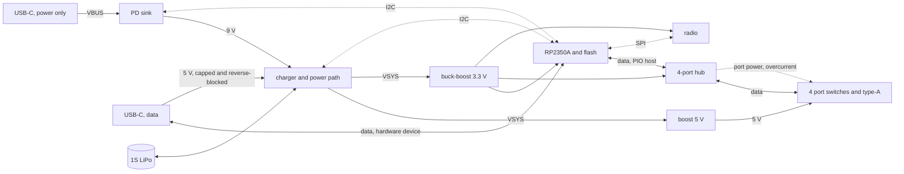

# crossfire hardware

The production board: an RP2350 hosting four USB instruments through a hub, powered from USB-C over
Power Delivery, with an optional radio and an optional battery.

**Status: prototype, nothing built.** Every number below is a budget or a datasheet figure, not a
measurement. A predecessor design exists elsewhere as a sketch of an earlier vision; it was never
manufactured or validated, so nothing here is inherited from it — individual parts are reused only
where they stand up on their own.

## What the board has to do

- Host four USB-MIDI instruments at once, on four type-A receptacles, each supplied with 5 V.
- Keep the firmware that already exists: the USB device role and its console, the signed
  A/B image pair with probation, and the radio update path.
- Present itself to a computer on the upstream connector *while* hosting the instruments, so the two
  roles live on separate interfaces.
- Take its power from an upstream USB-C connector, separate from the one a computer plugs into.
- Optionally carry a radio for over-the-air updates and for a client app to control it.
- Optionally run from a LiPo cell for at least an hour under load.

## Three decisions shape everything else

### 1. Two USB roles on two interfaces

The RP2350 has **one** USB controller, and the board needs two roles at once: host for the four
instruments, device for the computer on the upstream connector. The roles are kept apart on separate
interfaces — the hardware controller takes one, and a full-speed port built in PIO takes the other.
Nothing is multiplexed and nothing switches role, so a computer and the instruments are live at the
same time.

**The hardware controller faces outward as the device, and PIO hosts the hub.** The deciding
argument is recovery, and it beats the alternative on its own terms:

- **The boot ROM drives the hardware controller.** Putting that pair on the upstream connector means
  BOOTSEL and USB DFU work on the connector the product actually has. Recovery needs no debug probe,
  no case opened, nobody on the bench.
- **It makes the risky new thing the recoverable one.** The host side is what has to be rebuilt, and
  if that goes wrong the board can still be reflashed over its own port. The other way round, a rough
  device port takes the console and DFU with it and leaves only SWD.
- **Bring-up starts working rather than blocked.** The board is programmable and has a console over
  its own connector before any of the new firmware exists, so the host side can be brought up
  incrementally against a board that already talks.

What it costs, plainly: **the host role moves onto a new transport.** The existing host stack sits
behind a host-controller seam, so the stack, the hub handling and the MIDI layer above it are kept —
but the packet-level transport underneath becomes a full-speed USB host built in PIO, which does not
exist in this tree. That is the single largest piece of new firmware this board asks for, and it is
the harder of the two roles to build: it has to generate frames, schedule transactions across four
devices and a hub, and handle retries.

The device side, by contrast, is already proven on hardware — the console rides it today. The one
addition there is the computer-facing MIDI interface, which is a device class on a working stack.

**The upstream connector is unambiguous.** It sinks power and acts as a device, both, always — so
the CC lines mean one thing, there is no role to choose, and the charger-versus-computer guess that a
multiplexed design would have needed is gone. Electrically it is also the simpler end: the hardware
controller's pins carry their own impedance matching and pull-ups, so the pair needs only an ESD
array and the receptacle's two data pairs tied together, so a cable can go in either way up.

**The PIO port sets the system clock, and it sets it upward: 240 MHz.** Full-speed bit timing off PIO
wants a system clock that is an integer multiple of 12 MHz, so the state-machine divider is exact and
the bit period carries no fractional jitter. The stock 150 MHz is not such a multiple. Going *down* to
120 MHz would satisfy it at the cost of a fifth of the loop; going up to 240 MHz satisfies it and buys
the loop instead, and four things line up on that number:

- **12 MHz × 20.** Twenty system cycles per bit, and an exact divide by two if the state machine wants
  to run at 120 MHz. Either way the divider is an integer.
- **Twenty cycles a bit is a generous instruction budget** for the hardest software on the board. Ten
  would have been tight. The clock that makes the timing legal also makes the program easier to write.
- **It is already proven on this silicon.** A board in this codebase runs RP2350 at 240 MHz today,
  from the crystal through a 1440 MHz VCO and a divide by six, at stock core voltage.
- **The flash stays at its fastest legal clock.** A 133 MHz part divided by two off 240 MHz is
  120 MHz. Higher multiples are worse here, not better: 288 MHz would need a divide by three and drop
  the flash to 96 MHz.

So the constraint that looked like a tax is a 1.6× clock increase, and the forwarding loop gets
faster rather than slower. The device port is unaffected either way — its 48 MHz comes from the other
PLL.

**It is an overclock, though, and that is the part to weigh.** 240 MHz is above the datasheet's
150 MHz. It is proven on the boards in hand; it is not characterised across a production population
or a temperature range, and a product ships into both. What to establish before committing: whether
stock core voltage still holds at temperature, and what the fallback is if it does not — 192 MHz
(12 × 16) is the next multiple down that still beats stock, and 120 MHz is the floor that always
works.

The PIO port is the host end, so it carries 27 Ω series resistors on the pair and host-side
pull-downs; the 1.5 kΩ pull-up belongs to the hub, which asserts it on its own upstream port. It runs
entirely on the board, from GPIOs to the hub, and never reaches a connector or a cable — which is the
kindest possible first home for a software-timed USB port.

One consequence of hosting on-board: **no host supplies VBUS to the hub's upstream port**, so the hub
is self-powered, and its upstream-detect input is driven by the MCU. The datasheet is explicit about
this case: a *detachable* hub divides that pin down from the upstream VBUS, but a self-powered hub
with a permanently attached host takes it "from a dedicated host control output, or the 3.3 V domain
that powers the host" — so a GPIO, which costs one pin and hands the firmware the ability to hold
the hub down until it is ready and to force a re-enumeration by toggling it. Without that pin
asserted the hub never believes it is connected.

### 2. Two upstream connectors, one for power and one for data

Power and data arrive on **separate USB-C receptacles**. One connector would force a choice: a port
negotiating 9 V off a charger is not a port a computer is plugged into, so whichever you wanted, you
gave up the other. Two connectors means a 27 W brick and a computer at once, and neither constrains
the other.

| | receptacle | carries |
| --- | --- | --- |
| power | type-C, power only, 6-pin | CC to the PD sink, VBUS to the charger — the designed power input |
| data | type-C, USB 2.0, 16-pin | D+/D− to the hardware controller, Rd on both CC pins, ESD, VBUS sensed |

Splitting them also cleans up what each one means. The power port negotiates without caring what a
computer would think of the result. The data port is only ever a data link — BOOTSEL, DFU, the
console and the MIDI interface all live on a connector that does nothing else.

**The data port still contributes a little power**, and it has to. Without it, a board with no
battery and no charger cannot be reflashed from a laptop, which is exactly the situation a
manufacturing line and a returned unit are in. Its contribution is capped at the USB default: about
2.5 W, which runs the MCU, hub and radio and trickles the cell, and does not pretend to run the
ports. That is not a limitation worth fighting — a laptop was never going to supply the 10 W four
ports can ask for.

> **The reverse blocking has to be automatic, not timed by firmware.** The moment the power port
> negotiates 9 V, that voltage must not appear on a laptop's VBUS, and there is no software fast
> enough to be trusted with it. So the data port's contribution goes through a reverse-blocking
> element that the higher voltage shuts off by itself.

**Neither way of plugging it in wrongly does harm**, which matters because two identical receptacles
on one edge guarantee someone will. A charger in the data port presents as an ordinary 5 V source and
is used as one. A computer in the power port supplies 5 V and simply has no data pins to reach. Both
cases degrade; neither damages.

### 3. What "under load" means

Four ports at full USB 2.0 spec is 4 × 500 mA = 10 W, and an hour of that needs a cell around
4500 mAh. Class-compliant MIDI instruments draw 100–250 mA. Sizing the battery for a load no MIDI
instrument presents buys a much larger cell for nothing.

**Taken as:** the ports run to **full spec on external power**, and to a declared **250 mA each on
battery**. The power manager already exists and is portable, so the budget is policy rather than
silicon — the current limits in the port switches protect the hardware, and the policy decides what
is offered. This is the one assumption here that most wants confirming.

## Block structure



*Solid lines carry power or USB data; dashed lines are control.*

## Power

### Rails

| rail | source | sized for | why |
| --- | --- | --- | --- |
| VSYS | the charger's system node, 3.0–4.4 V | 4 A | the battery when unplugged, held up by the charger when not |
| 5 V (ports) | boost from VSYS | 2 A | **always the same converter**, so a port sees the same 5 V plugged in or not |
| 3.3 V | buck-boost from VSYS | 1 A | VSYS falls below 3.3 V on a flat cell, so a plain buck could not hold it |
| 1.1 V (core) | the MCU's own switching regulator | — | not a board converter, but it needs board parts: an inductor on `VREG_LX` and a feedback network, which is why it is a rail and not just decoupling |

The core rail catches people out, so it is worth stating: this MCU regulates its own core with a
*switching* regulator, not a linear one. It brings out `VREG_VIN`, `VREG_LX` and `VREG_FB`, so the
schematic carries an inductor and the rail it makes feeds the `DVDD` pins. The analogue supply for
the ADC wants its own filter off 3.3 V as well, which is worth keeping even with nothing presently
reading through it.

Port power comes from VSYS rather than straight off VBUS. It costs a conversion when plugged in
(about 90%), and it buys two things: a 5 V rail that does not change character when the cable is
pulled, and the freedom to negotiate 9 V upstream instead of being held to the 15 W that 5 V/3 A
allows. The cost-down that would have removed the boost — ports fed from VBUS, with the charger's
OTG output back-driving it on battery — died with the single upstream connector: VBUS is now a
power-only receptacle, and back-driving it powers nothing. The separate boost is settled.

### Budget

**3.3 V rail**

| | typical | peak |
| --- | --- | --- |
| RP2350A, both cores at 240 MHz, USB active | 110 mA | 150 mA |
| QSPI flash, executing in place | 15 mA | 25 mA |
| hub | 90 mA | 120 mA |
| radio, connected idle / transmitting | 60 mA | 350 mA |
| indicators, crystals, pull-ups | 25 mA | 40 mA |
| **total** | **300 mA** (0.99 W) | **685 mA** (2.3 W) |

**5 V rail**

| | current | power |
| --- | --- | --- |
| full USB 2.0 spec, 4 × 500 mA | 2.00 A | 10.0 W |
| declared battery budget, 4 × 250 mA | 1.00 A | 5.0 W |
| four typical MIDI instruments | 0.4–0.8 A | 2–4 W |

**Upstream**

Worst case on external power is 10.0 W of ports and 2.3 W of device, which is 13.6 W at VSYS after
conversion and about 14.8 W at the PD rail. Charging a 3000 mAh cell at 1.5 A adds 6 W.

> 5 V/3 A is 15 W and cannot do both. **Request 9 V at 3 A (27 W)**; accept 9 V/2 A with the charge
> current trimmed; fall back to 5 V/3 A with the ports held to the battery budget.

**Battery**

At the declared budget the board draws 6.7 W at VSYS. An hour of that is 6.7 Wh; a 1S cell at 3.7 V
nominal carries 1800 mAh of it, and roughly 90% is usable down to cutoff before any allowance for
age.

> **Specify a 3000 mAh 1S LiPo (11.1 Wh), rated 2 C continuous or better.** That is about 77 minutes
> at the declared budget and about 42 minutes with every port drawing its full 500 mA. Peak
> discharge at full spec is around 3.5 A, which is why the C rating is called out.

## Parts

Stock KiCad symbols exist for everything marked with one; the rest need drawing.

| block | part | symbol | why |
| --- | --- | --- | --- |
| MCU | RP2350A, QFN-60 | `MCU_RaspberryPi:RP2350A` | 30 GPIO is enough (see below); RP2350B if a display is added |
| flash | W25Q128JVS, 16 MB | `Memory_Flash:W25Q128JVS` | the A/B image pair plus the asset partition; 2 MB would not hold it, and its 133 MHz rating covers the 120 MHz the divider lands on |
| hub | USB2514B | `Interface_USB:USB2514B_Bi` | four downstream ports, per-port power and overcurrent pins, no external EEPROM needed |
| port switch ×4 | TPS2065C | `Power_Management:TPS2065CDBV` | 1 A threshold, **active-high enable, open-drain fault** — what the hub needs at both ends. It limits by going into constant current rather than latching off, and adds reverse blocking and output discharge, both of which a port wants. Its 0.5 A sibling is the same trap as before: that is the budget itself, with nothing for inrush |
| port data ESD ×4 | 2-channel array, low capacitance | — | needed because the switch above protects power only. The TPD3S0x4 would have covered both, but it has no fault output, so it cannot tell the hub anything |
| PD sink | HUSB238 | `Interface_USB:HUSB238_xxxDD` | already proven on hardware in this codebase, and it reports which profile was accepted |
| charger / PMIC | BQ25798 | `Battery_Management:BQ25798` | buck-boost, takes 9 V in directly, 1S charge, and an I²C ADC the power manager can read |
| 5 V boost | TPS61089 | `Regulator_Switching:TPS61089` | 5 A switch, comfortably 2 A out at 5 V from a 1S cell |
| 3.3 V | TPS63060 | `Regulator_Switching:TPS63060` | buck-boost, so 3.3 V survives a flat cell |
| data-port VBUS diode | Schottky, 1 A | — | the data port's whole contribution to the rail, and the reverse blocking that keeps 9 V off a laptop. Affordable only because that path is small |
| upstream data ESD | 2-channel array, low capacitance | — | the downstream pairs get theirs from the port switch; the upstream pair has no such part in front of it |
| power connector | USB-C, power only, 6-pin | `Connector:USB_C_Receptacle_PowerOnly_6P` | no data pins to mis-wire, and nothing on it a computer would want |
| data connector | USB-C 2.0, 16-pin | `Connector:USB_C_Receptacle_USB2.0_16P` | |
| port connectors ×4 | type-A | `Connector:USB_A` | |
| radio | CYW43439 module, pre-certified | — | the firmware is proven against this silicon; a module rather than the bare chip, so the radio arrives certified |

Two notes on the hub. Its upstream link runs at full speed, because the RP2350's controller is
full-speed only — so the whole tree is full speed and instruments that could do high speed fall
back, which costs nothing, as USB-MIDI 1.0 is a full-speed class. And the hub drives the port
switches itself: `PRTPWR[1:4]` to each switch's enable, each switch's fault back to `OCS_N[1:4]`. Port
power then goes on and off through ordinary hub requests that any host stack already makes,
overcurrent arrives as a standard port status change, and eight GPIOs stay free.

### GPIO budget

Eighteen of the thirty, and the assignment is not arbitrary — the PIO pair is forced adjacent and the
rest fall out of keeping peripherals on their default pins.

| GPIO | net | why there |
| --- | --- | --- |
| 0, 1 | `CONSOLE_TX`, `CONSOLE_RX` | UART0's default pair |
| 2 | `PD_ATTACH` | |
| 3 | — | spare |
| 4, 5 | `SDA`, `SCL` | I²C0's default pair; reaches the PD sink and the charger |
| 6 | `CHG_INT` | |
| 7 | `HUB_RESET` | |
| 8, 9 | `PIO_DP`, `PIO_DM` | **forced adjacent**, low pin first — the PIO program addresses the pair as a base and an offset |
| 10 | `RF_PWR` | |
| 11 | `RF_CS` | |
| 12, 13 | `RF_CLK`, `RF_DIO` | kept adjacent so the radio's PIO program can side-set the clock beside its data pin |
| 14, 15 | `LED_1`, `LED_2` | |
| 16 | `BUTTON` | |
| 17 | `VBUS_DET` | data-port VBUS present, so a self-powered device only attaches when a host is there |
| 18 | `HUB_VBUS_DET` | tells the hub its upstream is live; also the way to force a re-enumeration |
| 19–25 | — | spare, and still contiguous: seven in a row is a display bus |
| 26–29 | — | spare, and the only four that reach the ADC on this package |

Dedicated pins take the rest: QSPI to the flash, the hardware USB pair to the data receptacle, SWD to
the debug header, XIN/XOUT to the 12 MHz crystal, RUN to reset.

The boot button is not a GPIO. It pulls the flash's chip select low, the way the reference design
does, so it costs nothing from the budget above — and the button on GPIO 16 is a separate, ordinary
one.

## Sheets

| sheet | contents |
| --- | --- |
| `mcu` | RP2350A, flash, crystal, SWD, boot button, decoupling |
| `upstream_power` | the power-only receptacle, CC and the PD sink, VBUS out to the charger |
| `upstream_data` | the data receptacle, Rd, ESD on the hardware USB pair, VBUS sense and its capped contribution |
| `hub` | USB2514B, its 24 MHz crystal, the `RBIAS` resistor, the PIO host pair's series resistors and pull-downs, upstream detect from the MCU, and four downstream pairs |
| `port` | one port: switch, ESD array, receptacle, bulk capacitance — instanced four times |
| `power` | the ORing of the two inputs, the charger, battery connector and thermistor, the 5 V boost, the 3.3 V buck-boost |
| `radio` | the module, its bus and supply — fitted or not |

## The project as it stands

`crossfire.kicad_pro` is a KiCad 10 project holding the root sheet, seven child sheets and a project
symbol library for the parts with no stock symbol. The root carries the decomposition and the
interface: every sheet has its pins, every pin has a matching hierarchical label inside its sheet,
and every pin carries a named stub, so each net that crosses a block boundary is named and agreed.
`port.kicad_sch` is drawn once and instanced four times, with the root mapping its generic
`DP`/`DM`/`PWR_EN`/`FAULT` onto the hub's `Pn_*`.

**`mcu` and `hub` are populated; the other five are not.** `mcu` holds the MCU, the flash, the
core-rail inductor and its decoupling, the crystal, the analogue filter, reset and boot, the debug
and console header, the indicators and the button. `hub` holds the hub, its 24 MHz crystal, the
`RBIAS` reference, the two regulator filters, the straps that select the default configuration, the
reset and upstream-detect pull-downs, and the upstream pair's series resistors and host-side
pull-downs. Every pin of every part is on a named net.

Both are drawn the way a person would draw them: **signals are wires**, and only the rails and the
nets that leave the sheet are carried on symbols and labels. Parts sit beside the pins they serve —
the flash is placed so all six lines of its bus are single straight segments across to the MCU, and
on the hub every passive is turned side-on so it sits in line with its own pin. That last one is
what keeps a chip with fourteen left-hand pins from becoming a knot: each pin owns a row, and
nothing has to cross anything.

It can all be checked without opening the editor:

```
kicad-cli sch erc      -o erc.rpt crossfire.kicad_sch
kicad-cli sch export netlist -o crossfire.net crossfire.kicad_sch
```

The netlist is real: 79 nets, and the only unconnected pins are the twelve spare GPIOs the pin map
names and the three hub pins the datasheet says to leave alone — nothing has been left connected by
accident, and nothing intended has been missed.
Read it rather than the picture when checking this sheet; a wire that looks right and a wire that
*is* right are not the same thing, and the netlist is the one that answers.

ERC on the two drawn sheets reports only what is genuinely outstanding: `+3V3` and `GND` have no
source until the `power` sheet exists, and the hub's four over-current inputs have nothing driving
them until the `port` sheet does. The locally
generated rails, `+1V1` and the analogue supply, carry flags because a passive inductor and a
ferrite are not power sources.

The rest of the report is the six empty sheets: dangling hierarchical labels and stubs that reach no
pin. That count is the thing to watch, and it falls as each sheet is populated.

## Settled since

**The host stack's seam carries a PIO transport.** This was the first thing to establish and it
holds up. The stack is written against a `HostController` trait of eight methods — device detect,
root-port reset, control, bulk in, bulk out, and interrupt-pipe allocation — and everything above it
is generic over that trait, including the enumeration and the hub handling. It already has three
implementations, two chips and a mock, and the mock is the proof: the stack has been substituted
before. So the enumeration, the hub handling and the MIDI layer are all kept, and only the transport
underneath is new.

What that does *not* buy is a smaller job. The chip implementation is about 1,600 lines, and it
divides in two. The transfer-level half — splitting transfers into packets, reassembling them, pipe
bookkeeping — carries over in shape. The other half is register writes that ask the silicon to
generate frame markers and keep-alive, and to do CRC, bit stuffing, encoding and retries. **A PIO
transport has to supply all of that in software**, on a one-millisecond frame cadence and inside the
bus turnaround window. The seam being clean means the work is contained, not that it is small.

**The hub needs no EEPROM, and its defaults are already what this design wants.** Its configuration
register 06h powers up at 9Bh, and that value decodes to self-powered operation, over-current
sensing on a port-by-port basis, and port power switching on a port-by-port basis — the three things
this design depends on, all of them the factory default. An EEPROM or an SMBus master would only be
needed to change them, or to give the hub custom identifiers.

The same register answers the speed question. Its high-speed-disable bit is clear by default, which
means the part attaches as high- *or* full-speed, whichever the host offers; a full-speed host gets a
full-speed hub, and no configuration is required to make that happen. The bit exists to force
full-speed only, which is worth knowing about but not worth an EEPROM to set.

Two details that came out of the same reading and would have been found the hard way: the
over-current inputs carry internal pull-ups and are active low, so a switch with an open-drain fault
output connects straight to them with nothing in between; and the part wants a **12.0 kΩ ±1%
resistor from `RBIAS` to ground** to set its transceiver bias, which is easy to leave off a
schematic and not easy to diagnose afterwards.

**The 9 V request is three writes, and this codebase has already made them work.** Select the
profile by writing its index into the selection register, then write the go command; the order is
not interchangeable, because the go command acts on whatever the selection register holds at that
instant. Do not read the result back immediately — the negotiation finishes in its own time, and an
immediate read reports the *previous* contract and looks like a failure.

The trap is worth restating because it cost real time to find once already: **every register must be
written as a strictly framed two-byte transaction.** A general write path that sends the address and
the payload as two transfers separated by a repeated start is acknowledged by the part and stores
nothing — the selection register took five writes of five different values and read back zero after
every one, while every return code said success.

**The CC senses come off the design.** They were there so the firmware could learn whether the data
port's source offers more than the USB default. Asking what they needed answered the question
differently: they buy nothing, because the data port's contribution is capped by intent rather than
by what the source offers — it exists so a board with no battery and no charger can be reflashed,
not as an operating mode. Removing them takes two pins, four resistors and a clamp question off the
board. It also removes a subtler risk: any divider across CC sits in parallel with the termination
resistor that tells the source what we are, and shifting that is worse than not knowing.

**Which turns the ORing into one diode.** A prioritised ORing controller with external FETs was
specified because two sources meet at the charger and 9 V must never reach the data port. But the
data port now contributes at most the USB default, and a path that small can afford a Schottky: it
blocks reverse absolutely and without being told, it costs about a fifth of a watt on a path that is
rarely used at all, and the charger's buck-boost input does not care about the drop. The power port
stays direct, because a diode at 3 A would not be affordable — **on the condition that the sink's
own output switch opens when nothing is attached**, which is the one thing left to confirm there.

The charger can then tell its two sources apart without being told either: they arrive at different
voltages, and it measures input voltage already. Setting the input current limit from that is
firmware work, not a board question.

**The port switch had to change, and the reason is a pin that is not there.** The design said the
hub drives each port's switch and reads its fault back — which is the whole argument for letting the
hub own port power. But the part chosen for it, which integrates the current-limited switch and the
data-line protection in one package, has six pins: enable, ground, in, out, and the two data lines.
**There is no fault output.** It protects itself perfectly well and tells nobody, so the hub's
over-current inputs would have sat at their pull-ups reporting that all was well, for ever.

So the port becomes two parts instead of one: a current-limited switch that does have a fault
output, and a separate ESD array for the data pair. That costs four parts across the board and it
is the right trade — the alternative is a self-powered hub that cannot report over-current, which is
not a thing to ship.

Two polarities have to match and both are available in the wrong flavour, so they are worth naming.
The enable must be **active high**, because that is what the hub's port-power outputs drive, and the
same libraries carry active-low-enable siblings that would leave every port energised exactly when
the hub asked for off. The fault must be **open-drain and active low**, which suits the hub's
inputs directly — they are pulled up internally, so nothing goes between them.

**And one thing the switch still will not do: enforce the budget.** A 1 A threshold sits where it
should — above the port's 500 mA with room for inrush, and far enough below the rail to be worth
having — but four ports in limit is 4 A against a rail built for 2. That is the normal arrangement
rather than a fault: the budget is enforced above, by the hub's port power control and the
firmware's policy, and it only arises with four misbehaving devices at once. It does make **the
rail's own limit the backstop**, so the boost has to current-limit gracefully rather than latch off.
The chosen boost sets its limit with an external resistor, which is better than inheriting one —
what it does on reaching that limit is the part still to confirm.

**The PIO port and the radio do not contend.** Counted rather than assumed: the radio's bus takes
one state machine and eight of the thirty-two instruction slots in the first PIO block, four pins
and one DMA channel. The part has three PIO blocks of four state machines each, and sixteen DMA
channels. Giving the USB host a whole block of its own leaves a third block and most of the DMA
untouched, and any block can drive any pin, so the pin choice is not constrained by the split
either.

## Still to settle

Things this document asserts that a datasheet has to confirm before layout:

- That 240 MHz holds at temperature on stock core voltage, and what raising the core voltage would
  cost the power budget if it does not. 240 MHz is above the datasheet and proven only on the boards
  in hand, so a production population is the open question, not whether it runs.
- The QSPI divider at 240 MHz, and that the flash part chosen is rated for the 120 MHz it lands on.
- Whether the PD sink opens its output switch when nothing is attached. If it does not, the power
  port needs a blocking FET of its own so the data port cannot back-drive an exposed connector.
  Note that whatever sits on that shared node must tolerate 9 V, which rules out the 5.5 V-rated
  load switches that would otherwise have done the job. Its datasheet does not extract, so this one
  wants reading by eye.

- That the 5 V boost current-limits gracefully rather than latching off, since it is the real
  backstop behind four switches that each trip well above the port budget.
- Whether the radio module's antenna keep-out can be met at the board edge.

The questions above the electrical detail are all answered now. A computer and the instruments are
served at once, and this design does that. The declared battery budget of 250 mA a port stands, so
the 3000 mAh cell and the hour it buys are settled rather than assumed. And the two receptacles are
told apart by labelling — on the case, and on the silkscreen beneath it — which is a reasonable
answer given that neither way of getting it wrong does any harm.

The largest piece of work this board creates is not on the board: **a full-speed USB host in PIO**,
carrying the existing host stack on a new transport. Its shape is now known — eight methods, with
the frame cadence and the bit-level protocol to supply in software — but none of it is written. It
is worth proving on a development board against the existing firmware before this design is
committed to copper, because it is the one part of the architecture with nothing behind it yet, and
because it is what holds the system clock at 240 MHz, which everything else is timed against.
